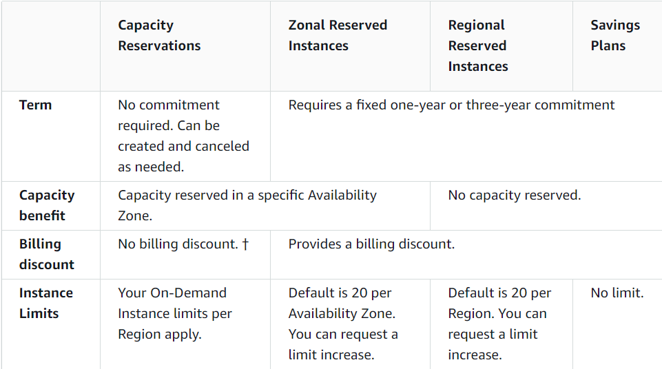
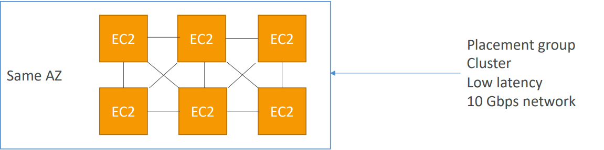
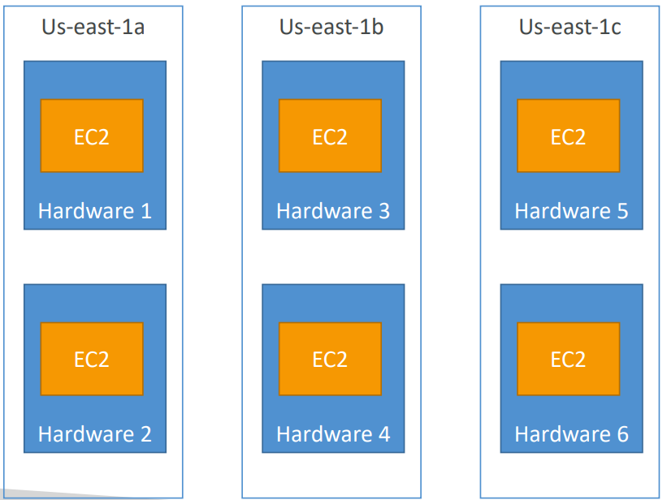
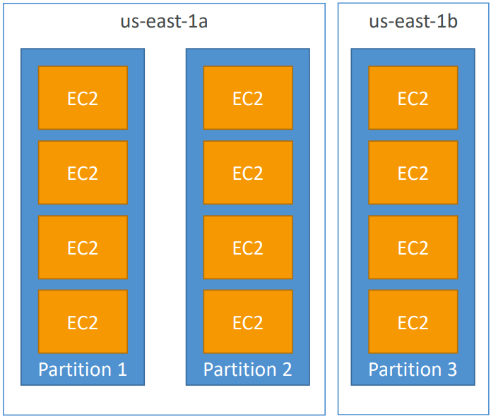

# Elastic Compute Cloud (EC2)

- Regional Service
- EC2 (Elastic Compute Cloud) is an **Infrastructure as a Service (IaaS)**
- Stopping & Starting an instance may change its public IP but not its private IP
- **AWS Compute Optimizer** recommends optimal AWS Compute resources for your workloads
- There is a vCPU-based On-Demand Instance soft limit per region.
- Some of EC2 config options include: OS, CPU, RAM, EBS/EFS, IP, Security Group, Bootstrap script.

## EC2 User Data

- Commands that will be executed when an instance is launched for the first time.
- It runs only when instance first starts.
- Used to automate **dynamic** boot tasks (that cannot be done using AMIs)
    - Installing updates
    - Installing software
    - Downloading common files from the internet
- Requires **root privilege**.
- **Bootstraping**: is the process of executing commands when a machine starts. 

## EC2 Instance Classes

- **General Purpose**
    - Balance between compute, memory & networking.
    - Suitable for **web server** or **code repository**.
- **Compute Optimized**
    - Suitable for compute intensive tasks, such as **Batch Processing**, **Media Transcoding**, **ML**, **Gaming Servers**
    - 'c' families (c5d.4xlarge)
- **Memory Optimized**
    - Suitable for **in-memory databases** or ** web caches**.
    - 'r', 'x', 'z' families.
- **Storage Optimized**
    - Good for storage intensive tasks, such as **data warehouse**, or **Distributed File System (DFS)**.

## Security Groups

- Security Groups are the fundamental of network security in AWS.
- They control how traffic is allowed into or out of our EC2 Instances.
- 
- External firewall for EC2 instances (if a request is blocked by SG, instance will never know).
- Security groups rules can reference a resource by IP or Security Group.
- Default SG
    - inbound (incoming) traffic from the same SG is allowed.
    - all outbound (outgoing) traffic is allowed.
- Security groups are acting as a “firewall” on EC2 instance.
	- Access to Ports
	- Authorized IP ranges – IPv4 and IPv6
	- Control of inbound network (from other to the instance)
	- Control of outbound network (from the instance to other)
- A security group can be attached to multiple instances and vice versa.
- Bound to a VPC (and hence to a region).
- Recommended to maintain a separate security group for SSH access.
- Blocked requests will give a **Time Out** error.
## Purchasing Options

#### On-demand Instances

- Pay per use (no upfront payment)
- Highest cost
- No long-term commitment
- Recommended for short-term, uninterrupted and **unpredictable** workloads

#### Standard Reserved Instances

- Reservation Period: 1 year or 3 years
- Up to 72% discount compared to On-demand
- You reserve a specific instance attributes (Instance Type, Region, Tenancy, OS)
- Recommended for steady-state applications (like database)
- **Sell unused instances** on the Reserved Instance Marketplace

#### Convertible Reserved Instances

- Reservation Period: 1 year and 3 years
- Up to 66% discount
- Can change the instance type
- Lower discount
- **Cannot sell unused instances** on the Reserved Instance Marketplace

#### Savings Instances

- Get a discount based on long-term usage (up to 72% - same as RIs)
- Commit to a certain type of usage ($10/hour for 1 or 3 years)
- Usage beyond EC2 Savings Plans is billed at the On-Demand price

#### Spot Instances

- Work on a bidding basis where you are willing to pay a specific max hourly rate for the instance. Your instance can terminate if the spot price increases.
- The MOST cost-efficient instances in AWS
- Useful for workloads that are resilient to failure
	- Batch jobs
	- Image processing
- **Not suitable for critical jobs or databases**

#### Dedicated Hosts

- Hardware is allocated to a specific use (not shared with other tenancy)
- The most expensive option
- Useful for software that have **BYOL (Bring Your Own License)** or for companies that have strong regulatory or compliance needs

#### Dedicated Instances

- Dedicated hardware
- Billed per instance
- No control over instance placement

#### On-Demand Capacity Reservations

- Reserve On-Demand instances capacity in a specific AZ for any duration
- Can reserve for a recurring schedule (everyday from 9AM to 5PM)
- No need for 1 or 3-year commitment (independent of billing discounts)

Reserved Capacity & Instances Comparison

## Spot Instances

#### Spot Requests

- **One-time**: Request once opened, spins up the spot instances and the request closes.
- **Persistent**:
    - Request will stay disabled while the spot instances are up and running.
    - It becomes active after the spot instance is interrupted.
    - If you stop the spot instance, the request will become active only after you start the spot instance.
- You can only cancel spot instance requests that are open, active, or disabled.
- Cancelling a Spot Request does not terminate instances. You must first cancel a Spot Request, and then terminate the associated Spot Instances.

#### Spot Fleets

- Combination of spot and on-demand instances (optional) that tries to **optimize for cost or capacity**
- **Launch Templates must be used to have on-demand instances in the fleet**
- Can consist of instances of different classes
- Strategies to allocate Spot Instances:
    - **lowestPrice** - from the pool with the lowest price (cost optimization, short workload)
    - **diversified** - distributed across all pools (great for availability, long workloads)
    - **capacityOptimized** - pool with the optimal capacity for the number of instances

## Elastic IP

- **Static Public IP** that you own as long as you don't delete it
- Can be attached to an EC2 instance (even when it is stopped)
- Limited to 5 elastic IPs per account
- Doesn’t incur charges as long as the following conditions are met:
    - The Elastic IP is associated with an Amazon EC2 instance
    - The instance associated with the Elastic IP is running
    - The instance has only one Elastic IP attached to it
- **Avoid using elastic IPs as they often result in poor architectural decision. Instead use random IP & register a DNS name to it, or use load balancer.**

## Placement Groups (Placement Strategies)

- When we want to control how AWS instances are placed within AWS hardware infrastructure.
- **Cluster Placement Group (networking)**
    - All the instances are placed on the same rack in a single AZ.
    - Pros: Great network (10 Gbps bandwidth between instances)
    - Cons: If the rack fails, all instances will fail at the same time
    - Used in **HPC** (minimize inter-node latency & maximize throughput)
        - 

- **Spread Placement Group (high availability)**
    - Each instance is in a separate AZ & different physical hardware.
    - Cons: limited to 7 instances per AZ per placement group.
    - Used for critical applications
        - 

- **Partition Placement Group (balance of performance and availability)**
    - Instances in a partition (different racks in with in  AZ).
    - If the rack goes down, the entire partition goes down
    - Up to 7 partitions per AZ
    - Used in **big data** applications (HDFS, HBase, Hadoop, Cassandra, Kafka)
        - 

## Elastic Network Interface (ENI)

- ENI is a virtual network card that **gives a private IP to an EC2 instance**
- A primary ENI is created and attached to the instance upon creation and will be deleted automatically upon instance termination.
- We can create additional ENIs and attach them to an EC2 instance to access it via multiple private IPs.
- We can detach & attach ENIs across instances
- **ENIs are tied to the subnet** (and hence to the AZ)

## Instance States

- **Stop**
    - EBS root volume is preserved
- **Terminate**
    - EBS root volume gets destroyed
- **Hibernate**
    - Hibernation saves the contents from the instance memory (RAM) to the EBS root volume
    - EBS root volume is preserved
    - The instance boots much faster as the OS is not stopped and restarted
    - When you start your instance:
        - EBS root volume is restored to its previous state
        - RAM contents are reloaded
        - Processes that were previously running on the instance are resumed
        - Previously attached data volumes are reattached and the instance retains its instance ID
    - Should be used for applications that take a long time to start
    - **Not supported for Spot Instances**
    - Max hibernation duration = **60 days**
- **Standby**
    - Used to install updates or troubleshoot a running instance

## EC2 Nitro

- Newer virtualization technology for EC2 instances
- Better networking options (enhanced networking, HPC, IPv6)
- Higher Speed EBS (64,000 EBS IOPS max on Nitro instances whereas 32,000 on non-Nitro)
- Better underlying security

## vCPU & Threads

- vCPU is the total number of concurrent threads that can be run on an EC2 instance
- Usually 2 threads per CPU core (eg. 4 CPU cores ⇒ 8 vCPU)

## Amazon Machine Image (AMI)

- AMIs are the image of the instance after installing all the necessary OS, software and configuring everything.
- It boots much faster because the whole thing is pre-packaged and doesn’t have to be installed separately for each instance.
- Good for static configurations
- **Bound to a region** (can be copied across regions)

> When the new AMI is copied from region A into region B, it automatically creates a snapshot in region B because AMIs are based on the underlying snapshots.

## Instance Metadata

- Url to fetch metadata about the instance (http://<public_ip>/latest/meta-data)
- This URL is internal to AWS and can only be hit from the instance

## EC2 Classic & ClassicLink

- Instances run in single network shared with other customers (this is how AWS started)
- **ClassicLink** allows you to link EC2-Classic instances to a VPC in your account

## Billing

- **Reserved instances will be billed regardless of their state** (billed for a reserved period)
- **On-demand instances in `stopping` state when preparing to hibernate will be billed**
- If an instance is running, it will be billed
- In all the other cases, an instance will not be billed

## Run Command

- Systems Manager **Run Command** lets you remotely and securely **manage the configuration** of your **managed instances**. A _managed instance_ is any EC2 instance that has been configured for **Systems Manager**.
- Run Command enables you to **automate common administrative tasks** and perform ad-hoc configuration changes at scale.
- You can use Run Command from the **AWS Console**, the AWS CLI, AWS Tools for Windows PowerShell, or the AWS SDKs. Run Command is offered at no additional cost.

## Instance Tenancy

- **Default**: Instance runs on shared hardware
- **Dedicated**: Instance runs on single-tenant hardware
- **Host**: Instance runs on dedicated host

> - Tenancy of an instance can only be changed from **host to dedicated** or **dedicated to host** after the instance has been launched.
> - Dedicated instance tenancy takes precedence over Default instance tenancy

## Troubleshooting

- The following are a few reasons why an instance might immediately terminate:
    - You’ve reached your EBS volume limit.
    - An EBS snapshot is corrupt.
    - The root EBS volume is encrypted and you do not have permissions to access the KMS key for decryption.
    - The instance store-backed AMI that you used to launch the instance is missing a required part.
