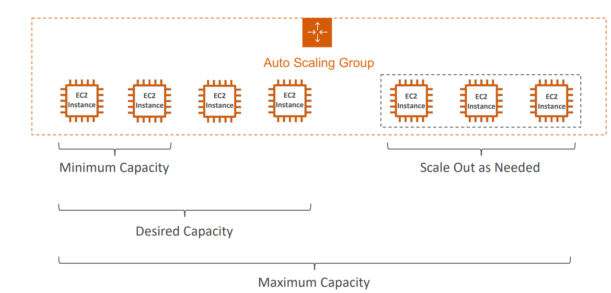

# Auto Scaling Group (ASG)

- Regional Service
- Supports Multi AZ
- Automatically scale in or scale out (add or remove instances) depending on the load
- IAM roles attached to an ASG will get assigned to the launched EC2 instances
- ASG can terminate instances marked as unhealthy by an ELB
- Make sure to have min and max number of instances assigned
- Free (pay for the underlying resources)
- 

## Launch Configuration & Launch Template

- A Launch Template (older “Launch Configurations” are deprecated)
	- AMI (Instance Type)
	- EC2 User Data
	- EBS Volumes
	- Security Groups
	- SSH Key Pair
	- Subnets (where the instances will be created)
	- Load Balancer (specify which ELB to attach instances)
	- Min / Max / Desired Capacity
	- Scaling Policy

- **Launch Template** (Recommended By AWS)
	- Allows to edit and update.
	- Maintains versions.
	- Allow provisioning using both _On-demand_ and _Spot Instances_.
- **Launch Configuration** (legacy)
	- Need to be re-created every time - can't be updated
	- Doesn't support _Spot Instance_

## Auto Scaling Policies

- **Target Tracking Scaling**
	- Scales based on a target metric, like CPU utilization or request count per target.
	- Automatically adjusts capacity to maintain the target metric at a specified value.
- **Step Scaling**
	- Scales based on a series of scaling adjustments (steps).
	- Each step adjusts capacity based on predefined thresholds for a specified metric.
- **Simple Scaling (Up/Down)**
	- Scales based on a single scaling adjustment.
	- Increases or decreases capacity by a specified number of instances or a percentage of the current capacity.
- **Scheduled Scaling:**
	- Scales based on a predefined schedule.
	- Allows you to set capacity adjustments based on known traffic patterns or events.
- **Dynamic Scaling**
	- Uses predictive scaling based on historical data and machine learning.
	- Adjusts capacity proactively to accommodate expected demand changes.

### Good metrics to scale on
- CPU Utilization
- RequestCountPerTarget
- Network Bandwidth
- Any custom metric (that you push using CloudWatch)

> After a scaling activity happens, you are in the cooldown period (default 300 seconds).
> During the cooldown period, the ASG will not launch or terminate additional instances (to allow for metrics to stabilize).
> Advice: Use a ready-to-use AMI to reduce configuration time in order to be serving request fasters and reduce the cooldown period.
